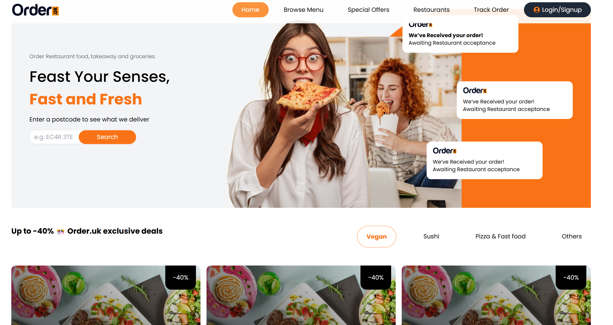

# OrderUK 
Food Order App is a modern food ordering website built with React and Vite, allowing users to browse menus, add items to the cart, and place orders seamlessly.

## 📜 Features

- 🛍️ Browse food categories and items  
- 🛒 Add items to the cart and adjust quantities  
- 💳 Secure checkout process  
- 🔍 Search and filter menu items  
- 📱 Fully responsive design  

## 🚀 Live Demo

[🔗 View Demo](https://huytd-it.github.io/my-first-store/)


## 📦 Installation

```sh
git clone https://github.com/huytd-it/my-first-store.git
cd your-repo-name
npm install
npm run dev
```
## Folder Structure
```txt
my-react-app/
├── src/
│   ├── components/
│   │   ├── common/
│   │   │   ├── Button/
│   │   │   ├── Card/
│   │   │   └── Modal/
│   │   ├── features/
│   │   │   ├── Authentication/
│   │   │   └── Dashboard/
│   │   └── layout/
│   │       ├── Header/
│   │       └── Footer/
│   ├── pages/
│   │   ├── Home/
│   │   ├── Dashboard/
│   │   └── Settings/
│   ├── hooks/
│   ├── services/
│   ├── utils/
│   ├── constants/
│   ├── types/
│   ├── context/
│   ├── assets/
│   └── styles/

```
## 🎨 Design Prototype

Check out the UI/UX design on Figma:  

[🔗 Figma Design](https://www.figma.com/design/cuDRzFIrO9VEAZCG4kKAYF/Food-Delivery-Website-%26-App-Design-UI-Kit-(Community)-(Copy)?node-id=4-2&t=p0q5xmjnjnZNl1aM-0)